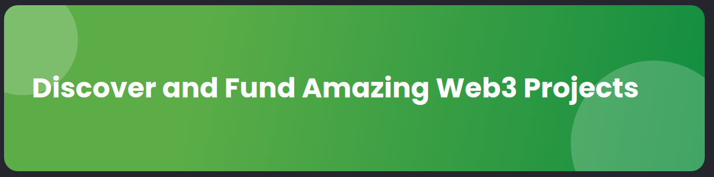

## GrantsCube Decentralized Crowdfunding DApp for Web3 Creators in Africa

This is a crowdfunding dapp intended showcase African creatives in the web3 space, where they can create projects they want to be funded by the community. Contributors get a minted NFT representing each projects the have funded as a memento of sorts.

The Contracts [`grantscube_contracts`](https://github.com/tricelex/grantscube_contracts) are written in Solidity,with the aid of Hardhat and ApeWorkx for Deployment and local testing.

While the frontend is a [Next.js](https://nextjs.org/) project bootstrapped with [`create-next-app`](https://github.com/vercel/next.js/tree/canary/packages/create-next-app) and deployed on Vercel.

## Contracts

**ProjectFactory.sol**

The first contract is the Factory Contract. This contract is responsible for creating and maintaining a list of all Project contracts. ProjectFactory also offers a contribute method which can be used to contribute directly to a Project.

**Project.sol**

This contract contains all of the logic around how a crowdfunding project should operate. Projects are "locked" to their Funding Hub and can only receive funds sent thru the associated FundingHub contract address.

**GrantsCubeNFTFactory.sol**

Thecontract is the NFT Factory Contract. This contract is responsible for creating and maintaining a list of all NFT contracts representing projects.

**GrantsCubeNft.sol**

This is an ERC721 contract Representing tokens minted to contributors on succesful donation.

## Deployment

The Contract is deployed on Polygon's zkEVM Test Net [`GrantsCube Contract`](https://explorer.public.zkevm-test.net/address/0x6000725847255dDAA1425C73244a9805B31B6d1A/)

The front end is lie at [`GrantsCube`](http://grantscube-frontend.vercel.app/)

Contracts Repo is at [`grantscube_contracts`](https://github.com/tricelex/grantscube_contracts)

## Getting Started

First, run the development server:

```bash
npm run dev
# or
yarn dev
```

Open [http://localhost:3000](http://localhost:3000) with your browser to see the result.

You can start editing the page by modifying `pages/index.tsx`. The page auto-updates as you edit the file.

[API routes](https://nextjs.org/docs/api-routes/introduction) can be accessed on [http://localhost:3000/api/hello](http://localhost:3000/api/hello). This endpoint can be edited in `pages/api/hello.ts`.

The `pages/api` directory is mapped to `/api/*`. Files in this directory are treated as [API routes](https://nextjs.org/docs/api-routes/introduction) instead of React pages.

## Learn More

To learn more about Next.js, take a look at the following resources:

- [Next.js Documentation](https://nextjs.org/docs) - learn about Next.js features and API.
- [Learn Next.js](https://nextjs.org/learn) - an interactive Next.js tutorial.

You can check out [the Next.js GitHub repository](https://github.com/vercel/next.js/) - your feedback and contributions are welcome!

## Deploy on Vercel

The easiest way to deploy your Next.js app is to use the [Vercel Platform](https://vercel.com/new?utm_medium=default-template&filter=next.js&utm_source=create-next-app&utm_campaign=create-next-app-readme) from the creators of Next.js.

Check out our [Next.js deployment documentation](https://nextjs.org/docs/deployment) for more details.
